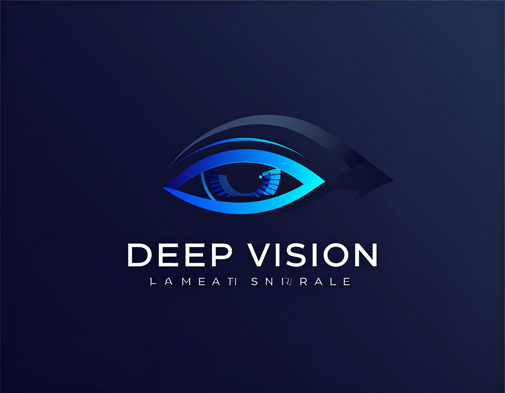
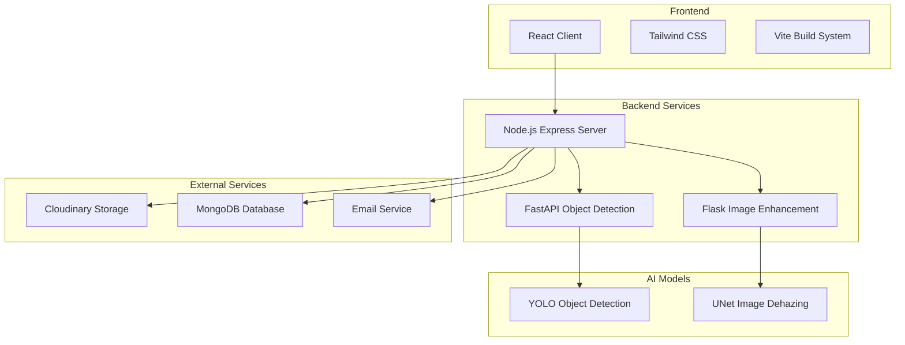

# 🌊 DeepVision: AI-Powered Underwater Vision System

<div align="center">



**Vision beneath the surface** - AI-driven image enhancement to improve visibility and detect underwater threats

[](https://python.org)
[](https://reactjs.org)
[](https://nodejs.org)
[](https://fastapi.tiangolo.com)
[](https://pytorch.org)

</div>

## 📋 Table of Contents

- [Overview](#overview)
- [Features](#features)
- [Architecture](#architecture)
- [Technology Stack](#technology-stack)
- [Installation](#installation)
- [Usage](#usage)
- [API Documentation](#api-documentation)
- [Project Structure](#project-structure)
- [Contributing](#contributing)
- [License](#license)

## 🌟 Overview

DeepVision is a comprehensive AI-powered system designed for underwater image enhancement and threat detection. The platform combines advanced computer vision techniques with modern web technologies to provide real-time image processing, enhancement, and automated threat identification for underwater environments.

### Key Capabilities

- **🔍 Underwater Image Enhancement**: AI-powered dehazing and visibility improvement using UNet architecture
- **🎯 Object Detection**: YOLO-based detection of underwater threats and objects
- **📧 Real-time Alerts**: Automated email notifications for detected threats
- **☁️ Cloud Storage**: Integrated Cloudinary storage for processed images
- **📊 Analytics Dashboard**: Historical data visualization and system monitoring
- **🔧 Operator Profiles**: Configurable alert settings and contact management

## ✨ Features

### 🤖 AI-Powered Image Processing
- **Underwater Image Dehazing**: Advanced UNet-based model for improving underwater image clarity
- **Object Detection**: YOLO v8/v11 models trained for underwater object detection
- **Real-time Processing**: Fast inference with GPU acceleration support
- **Batch Processing**: Support for video and image batch processing

### 🌐 Modern Web Interface
- **Responsive Design**: Mobile-first design with Tailwind CSS
- **Real-time Updates**: Live processing status and results
- **Interactive Dashboard**: Comprehensive analytics and historical data
- **File Upload**: Drag-and-drop image and video upload support

### 🔔 Alert System
- **Automated Notifications**: Email alerts for detected threats
- **Configurable Settings**: Operator profile management
- **Threat Classification**: Detailed threat detection reporting
- **System Logs**: Comprehensive logging and monitoring

### 🏗️ Scalable Architecture
- **Microservices**: Modular design with separate services
- **Docker Support**: Containerized deployment options
- **Cloud Integration**: Cloudinary for image storage
- **Database Integration**: MongoDB for data persistence

## 🏛️ Architecture



## 🛠️ Technology Stack

### Frontend
- **React 19.1+** - Modern UI library
- **Vite** - Fast build tool and dev server
- **Tailwind CSS** - Utility-first CSS framework
- **React Router** - Client-side routing
- **Axios** - HTTP client for API calls

### Backend
- **Node.js** - JavaScript runtime
- **Express.js** - Web framework
- **FastAPI** - Python web framework for object detection
- **Flask** - Python web framework for image enhancement
- **MongoDB** - NoSQL database
- **Mongoose** - MongoDB object modeling

### AI/ML
- **PyTorch 2.0+** - Deep learning framework
- **Ultralytics YOLO** - Object detection models
- **OpenCV** - Computer vision library
- **NumPy** - Numerical computing
- **PIL/Pillow** - Image processing

### DevOps & Deployment
- **Docker** - Containerization
- **Cloudinary** - Cloud image/video management
- **Nodemailer** - Email service
- **Multer** - File upload handling

## 🚀 Installation

### Prerequisites

- **Node.js** 18.0 or higher
- **Python** 3.10 or higher
- **MongoDB** (local or cloud instance)
- **Git**

### 1. Clone the Repository

```bash
git clone https://github.com/AyushRaj-10/DeepVision.git
cd DeepVision
```

### 2. Environment Setup

Create environment files for each service:

```bash
# Server/.env
MONGODB_URI=mongodb://localhost:27017/deepvision
CLOUDINARY_CLOUD_NAME=your_cloud_name
CLOUDINARY_API_KEY=your_api_key
CLOUDINARY_API_SECRET=your_api_secret
EMAIL_HOST=smtp.gmail.com
EMAIL_PORT=587
EMAIL_USER=your_email@gmail.com
EMAIL_PASS=your_app_password

# object_detection/.env
HF_TOKEN=your_huggingface_token
HF_USERNAME=your_hf_username

# under-water_imaging-main/.env
FLASK_ENV=production
```

### 3. Backend Setup

#### Node.js Server
```bash
cd Server
npm install
npm start
```

#### Object Detection Service (FastAPI)
```bash
cd object_detection
pip install -r requirements.txt
uvicorn app:app --host 0.0.0.0 --port 7860
```

#### Image Enhancement Service (Flask)
```bash
cd under-water_imaging-main
pip install -r requirements.txt
python app.py
```

### 4. Frontend Setup

```bash
cd Client
npm install
npm run dev
```

### 5. Docker Deployment (Optional)

```bash
# Build and run object detection service
cd object_detection
docker build -t deepvision-detection .
docker run -p 7860:7860 deepvision-detection

# Build and run image enhancement service
cd under-water_imaging-main
docker build -t deepvision-enhancement .
docker run -p 5000:5000 deepvision-enhancement
```

## 📖 Usage

### 1. Web Interface

1. **Start the application** by running all services
2. **Navigate to** `http://localhost:5173` (React dev server)
3. **Upload an image** using the upload button
4. **Click "Enhance Image"** to process
5. **View results** including enhanced image and threat detection
6. **Configure alerts** in the Profile section

### 2. API Usage

#### Image Upload and Processing

```bash
curl -X POST http://localhost:3001/api/upload \
  -F "file=@your_image.jpg" \
  -H "Content-Type: multipart/form-data"
```

#### Object Detection API

```bash
curl -X POST http://localhost:7860/detect \
  -F "file=@your_image.jpg"
```

#### Image Enhancement API

```bash
curl -X POST http://localhost:5000/enhance \
  -F "file=@your_image.jpg"
```

### 3. Training Custom Models

#### Train Object Detection Model
```bash
cd object_detection
python train.py --data data.yaml --epochs 100 --batch-size 16
```

#### Train Image Enhancement Model
```bash
cd under-water_imaging-main
python train.py --epochs 20 --batch-size 16 --lr 0.0001
```

## 📚 API Documentation

### Object Detection API (FastAPI)

**Base URL**: `http://localhost:7860`

| Endpoint | Method | Description |
|----------|--------|-------------|
| `/detect` | POST | Detect objects in uploaded image |
| `/detect-video` | POST | Process video for object detection |
| `/status/{job_id}` | GET | Check processing status |

### Image Enhancement API (Flask)

**Base URL**: `http://localhost:5000`

| Endpoint | Method | Description |
|----------|--------|-------------|
| `/enhance` | POST | Enhance underwater image |
| `/batch-enhance` | POST | Process multiple images |

### Main Server API (Express)

**Base URL**: `http://localhost:3001`

| Endpoint | Method | Description |
|----------|--------|-------------|
| `/api/upload` | POST | Upload and process images |
| `/api/profile` | GET/POST | Manage operator profiles |
| `/api/logs` | GET | Retrieve system logs |

## 📁 Project Structure

```
DeepVision/
├── Client/                    # React frontend
│   ├── src/
│   │   ├── components/        # Reusable UI components
│   │   ├── pages/            # Page components
│   │   ├── context/          # React context providers
│   │   └── main.jsx          # Application entry point
│   ├── public/               # Static assets
│   └── package.json
├── Server/                   # Node.js backend
│   ├── controllers/          # Request handlers
│   ├── models/              # Database models
│   ├── routes/              # API routes
│   ├── utils/               # Utility functions
│   └── server.js            # Server entry point
├── object_detection/         # YOLO object detection service
│   ├── app.py               # FastAPI application
│   ├── model.py             # YOLO model wrapper
│   ├── train.py             # Training script
│   ├── checkpoints/         # Model weights
│   ├── dataset/             # Training data
│   └── requirements.txt
├── under-water_imaging-main/ # Image enhancement service
│   ├── app.py               # Flask application
│   ├── model.py             # UNet model definition
│   ├── train.py             # Training script
│   ├── checkpoints/         # Model weights
│   └── requirements.txt
└── README.md
```

## 🤝 Contributing

We welcome contributions! Please follow these steps:

1. **Fork the repository**
2. **Create a feature branch**: `git checkout -b feature/amazing-feature`
3. **Commit your changes**: `git commit -m 'Add amazing feature'`
4. **Push to the branch**: `git push origin feature/amazing-feature`
5. **Open a Pull Request**

### Development Guidelines

- Follow the existing code style
- Add tests for new features
- Update documentation as needed
- Ensure all services start without errors

### Testing

```bash
# Frontend tests
cd Client
npm test

# Backend tests
cd Server
npm test

# Python tests
cd object_detection
python -m pytest

cd under-water_imaging-main
python -m pytest
```

## 📄 License

This project is licensed under the MIT License - see the [LICENSE](LICENSE) file for details.

## 🙏 Acknowledgments

- **Ultralytics** for the YOLO implementation
- **PyTorch** team for the deep learning framework
- **React** and **Vite** teams for the frontend tools
- **FastAPI** and **Flask** teams for the Python web frameworks

## 📞 Support

For support and questions:

- 📧 Email: support@deepvision.ai
- 💬 Discord: [DeepVision Community](https://discord.gg/deepvision)
- 📖 Documentation: [Wiki](https://github.com/AyushRaj-10/DeepVision/wiki)
- 🐛 Issues: [GitHub Issues](https://github.com/AyushRaj-10/DeepVision/issues)

---

<div align="center">

**Made with ❤️ for underwater exploration and safety**

[⭐ Star this repo](https://github.com/AyushRaj-10/DeepVision) | [🍴 Fork it](https://github.com/AyushRaj-10/DeepVision/fork) | [🐛 Report Bug](https://github.com/AyushRaj-10/DeepVision/issues)

</div>
